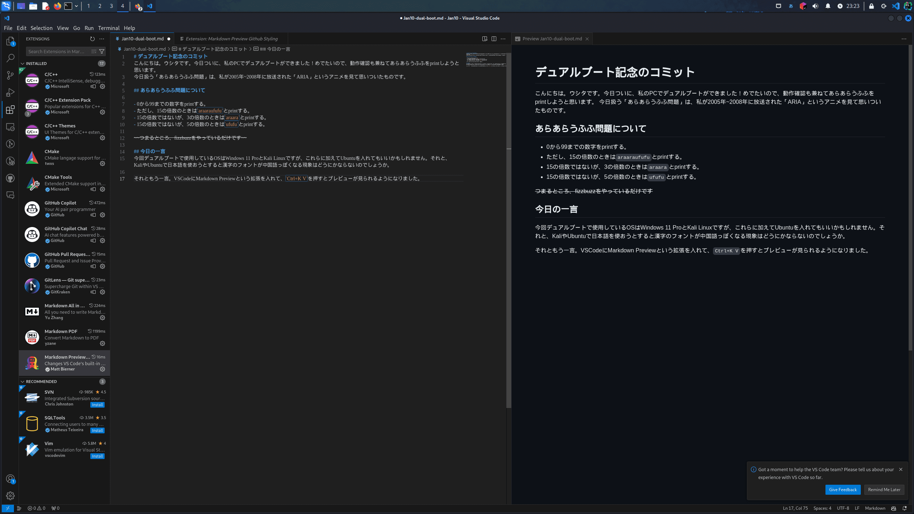

# デュアルブート記念のコミット
こんにちは。ウシタです。今日ついに、私のPCでデュアルブートができました！めでたいので、動作確認も兼ねてあらあらうふふをprintしようと思います。
今日扱う「あらあらうふふ問題」は、私が2005年~2008年に放送された「ARIA」というアニメを見て思いついたものです。

## あらあらうふふ問題について

- 0から99までの数字をprintする。
- ただし、15の倍数のときは`araaraufufu`とprintする。
- 15の倍数ではないが、3の倍数のときは`araara`とprintする。
- 15の倍数ではないが、5の倍数のときは`ufufu`とprintする。

~~つまるところ、fizzbuzzをやっているだけです~~

## 今日の一言
今回デュアルブートで使用しているOSはWindows 11 ProとKali Linuxですが、これらに加えてUbuntuを入れてもいいかもしれません。それと、KaliやUbuntuで日本語を使おうとすると漢字のフォントが中国語っぽくなる現象はどうにかならないのでしょうか。

それともう一言。VSCodeにMarkdown Previewという拡張を入れて、`Ctrl+K V`を押すとプレビューが見られるようになりました。
以下のような表示になります。

