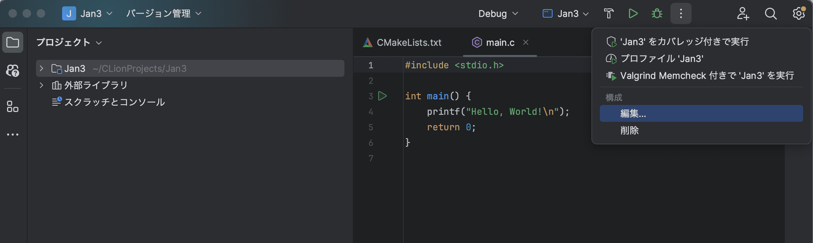
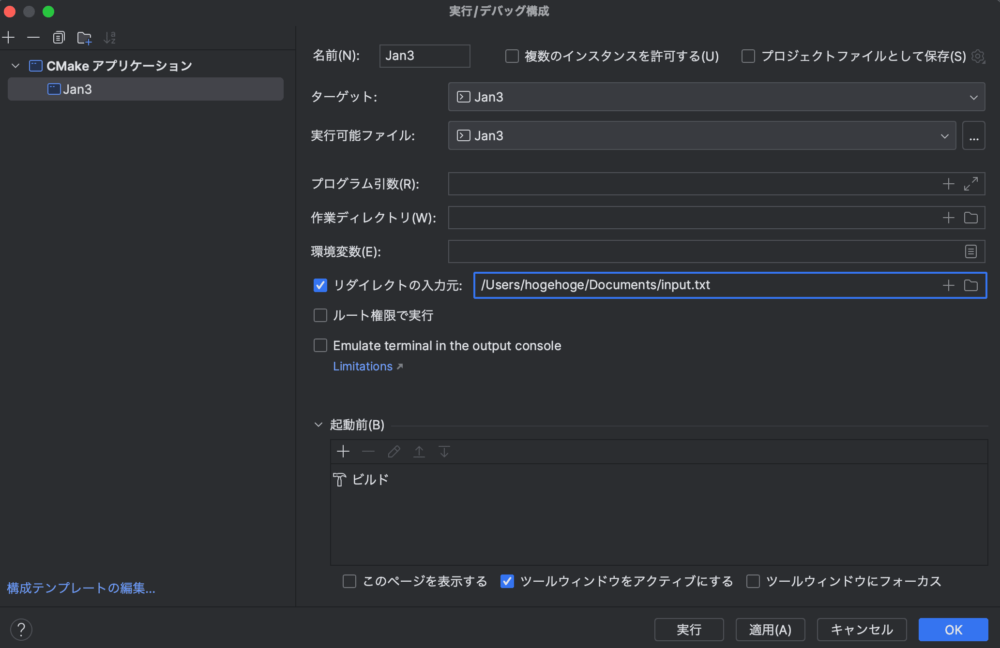
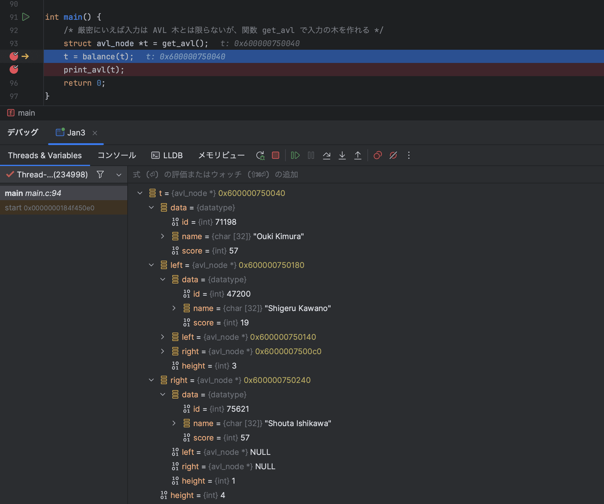

# CLionを使ったデバッグ
こんにちは。ウシタです。新年3日目にして、もしかして「毎日GitHubに何かCommitする」という目標はなかなかハードなんじゃないか、という気がしてきました。休み明けで忙しくなったり、旅行に行ってるときはどうしよう...

繰り返しになりますが、私はITに詳しくないけど詳しくなろうとしている、現在進行形で成長中(と信じている)人です。そのため、至らない点が多々あると思います。ご指摘、お叱り、アドバイスなどあれば、どんどん送るなりPull Requestを送るなりしてください。

## リダイレクトで入力を受け取れるのが素晴らしい
C言語で書かれたプログラムで、ファイルから入力を受け取りたい、というときはどうすれば良いか。1つ目の方法は、コマンドライン引数を使って、`argv`にファイル名を渡して、そのファイル名に対して`fopen`を使えば良い。

しかし、この方法では標準入力に流れてくるものを受け取ることはできない。ではどうするか。その答えが2つ目の方法で、`./a.out < input.txt`のようにターミナルのリダイレクトを使えば良い。

ここで、とある問題が発生する。それは、`.c`のファイルを修正するたびにターミナル開いてコンパイルして実行するのが面倒くさい、ということである。~~世の中にはmakefileとかシェルスクリプトとかいう便利なものがあるらしいですが、私は未だ使えません~~ そんな時は、IDEの機能を使えば良い。
VSCodeでは(私が探した限り)入力をリダイレクトしてくれるような機能は見当たらなかったが、CLionにはあった。





「構成」を「編集...」して、「リダイレクトの入力元」の横にチェックをつけて、ファイル名を記述すれば、`main.c`を実行する時に、そのファイルを標準入力から受け取ってくれる。

## デバッグプリントの代わりにIDEのデバッグ機能を使おう
ある変数の中に入っている値を見たい場合はどうすれば良いか。一つの方法として、デバッグプリントを使うことができる。例えば、`printf("id: %d\n", t.data.id); fflush(stdout);`などと書けば、`t.data.id`に入っている値(この場合は`int型`)をみることができる。ただ、デバッグプリントを埋め込むときにバグを仕込んだり、プリントした内容が多すぎるとコーディングした本人でさえ何を出力しているのか分からなくなったりする可能性がある。

IDEというものはよくできていて(~~当たり前だ~~)、わざわざプリントしなくても変数の中の値を見られる機能を用意している。再びCLionの場合を取り上げるが、以下のように`t` `t.data` `t.left` `t.right` `t.height` などが一覧表示されている。



ここで、`t`は以下に示すようなAVL木の節点(ノード)を表す構造体である。
```
struct student { int id; char name[32]; int score; };
typedef struct student datatype; /* ← 格納するデータは構造体 student */
struct avl_node { datatype data; struct avl_node *left, *right; int height; };
```
一覧性・可読性というのは非常に重要で、これによってデバッグにかかるスピードや、バグの発見のしやすさが大きく変わってくる。私はCLionのデバッグ機能を知ってから、`printf`でデバッグしていた頃に比べ、バグを修正するのにかかる時間が短縮されたように感じる。

## 今日の一言
世の中には便利なツールがたくさんあるので、それを使いこなせるようになりたいです。生産性を上げるために日々努力しましょう。
最近、VSCodeやCLionで検索や置換をするときに正規表現を使うようになって、あぁ便利だなぁと思ったので、もう少し勉強します。Try Harder.