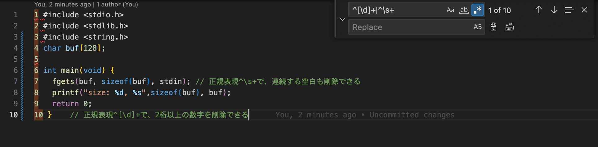

# 今すぐに使える正規表現
こんにちは。ウシタです。デュアルブートに苦戦しています。

## 行頭の余計な数字やスペースを除去する
`^[\d]+|^\s+`で、行頭の連続する数字もしくは半角スペースを検索できる。VSCodeで、`Ctrl`+`H`(Win, Linux)または`Command`+`Option`+`F`で置換のメニューが開くので、置換対象の文字列を入力し、置換対象の代わりに入れる文字列の欄は空けておけば、その対象文字列を削除できる。

これがどんな時に役に立つかというと、LaTeXで書かれたPDFからソースコードをコピーしてくる時である。`jlisting`,`jvlisting`,`listings`パッケージなどを用いて、LaTeXによりソースコードを記述することがある。ここで、マウスで範囲を選択してコピーしようとしても、本来コピーしなくて良い行番号などがコピーされてしまい、扱いが面倒になる。

このとき、行頭の余計な数字だけ削除すれば、コンパイルが通りコードが実行できるようになることが多々ある。また、ソースコードそのものに番号を埋め込まなくても、エディタやIDEが行番号を表示する機能を提供しているので、その機能を使う方がエラーが少なく便利である。

## 今日の一言
忙しくてコミットが~~ギリギリに~~ 間に合わず、翌日1/10になってしまいました。毎日続けるって難しいですね。Try Harder.