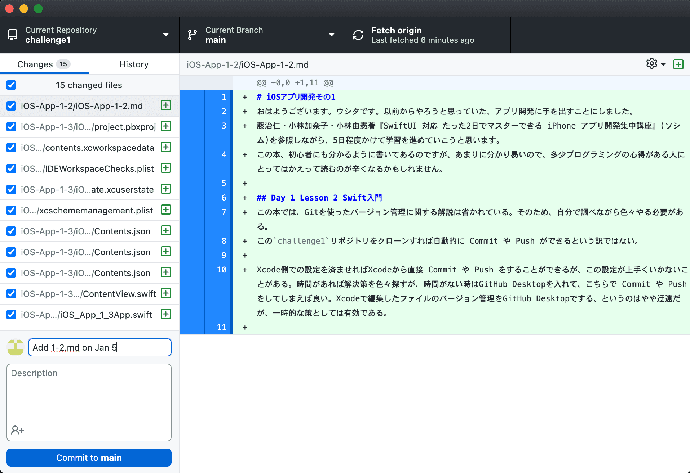
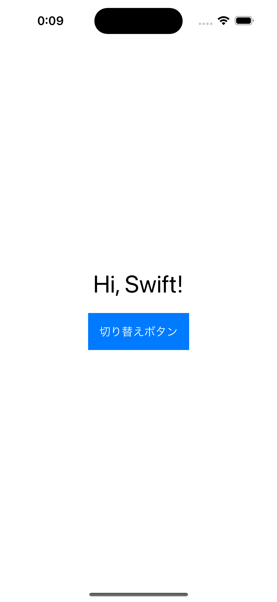

# iOSアプリ開発その1
おはようございます。ウシタです。以前からやろうと思っていた、アプリ開発に手を出すことにしました。
藤治仁・小林加奈子・小林由憲著『SwiftUI 対応 たった2日でマスターできる iPhone アプリ開発集中講座』(ソシム)を参照しながら、5日程度かけて学習を進めていこうと思います。(以降では本のタイトルを略して「集中講座」と呼ぶことにします)
この本、初心者にも分かるように書いてあるのですが、あまりに分かり易いので、多少プログラミングの心得がある人にとってはかえって読むのが辛くなるかもしれません。

## プロジェクトをGitで管理する
この本では、Gitを使ったバージョン管理に関する解説は省かれている。そのため、自分で調べながら色々やる必要がある。
この`challenge1`リポジトリをクローンすれば自動的に Commit や Push ができるという訳ではない。

Xcode側での設定を済ませれば Xcode から直接 Commit や Push をすることができるが、この設定が上手くいかないことがある。時間があれば解決策を色々探すが、時間がない時はGitHub Desktopを入れて、こちらで Commit や Push をしてしまえば良い。Xcodeで編集したファイルのバージョン管理をGitHub Desktopでする、というのはやや迂遠だが、一時的な策としては有効である。

Commit to main という青いボタンを押すと、上部の Fetch origin というボタンが Push origin に変わる。これを押せばリモートリポジトリに Push できる。

## シミュレータ
Xcode と iOSシミュレータを使えば、実機がなくてもテストができる。以下は、集中講座のDay 1 Lesson 2を読みながら開発したアプリを、iPhone 15 Pro で動かした時のスクリーンショットである。

もちろん、実機でも動かすこともできる。私が持っている iPhone 13 Pro で動かした時のスクリーンショットを以下に示す。

このように比較してみると、(使用する機種による差はあるものの)簡単なアプリであれば、シミュレータでも十分動作の確認ができると分かる。

では、シミュレータで動かすのが難しいものは何だろうか。少なくとも、シミュレータはマウスやトラックパッドを操作して動かすのに対し、実機はタッチパネルで動かすので、UIの検証が大変であるという予想はつく。また、アプリをリリースする時は必ず実機でのチェックが必要になるので、シミュレータがあるからと言って実機が不要になるわけではない。

## 今日の一言
Gitの使い方全然わからん... 今のところずっと`main`ブランチで作業してるので、他のブランチを生やすということもなく、merge を(手を動かしながら)勉強することもないです。~~ステージというものと`git add`コマンドでしていることが同義だと気がついたのも今日です~~

この`.md`ファイルを書いていて思ったのですが、コミットする前にプレビューを確認すれば、コミットした後の修正コミットが減るんじゃね？と思いまして。それで確認してみたのですが、画像がうまく表示されないんですよね。見出しや取り消し線は表示されるのですが、何かの不具合か、それとも仕様なのか、ｺﾚｶﾞﾜｶﾗﾅｲ

シミュレータは使い始めたばかりなので、実際のところ「完全に理解した(何もわかんない)」状態です。今の頑張りを続けたら少しは理解できるようになると信じて... Try Harder.